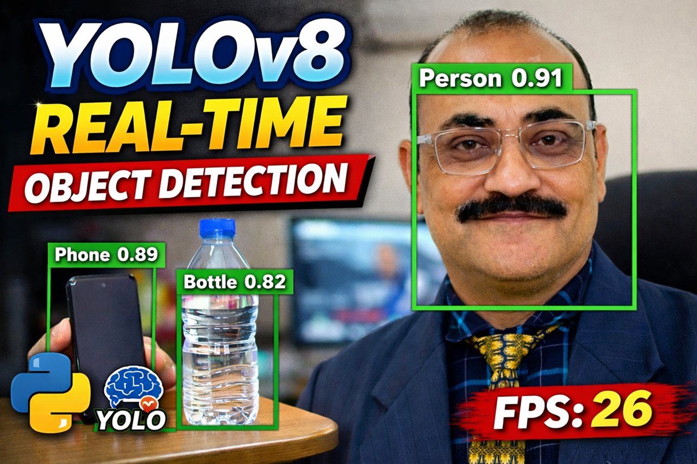

# Real-Time Object Detection using YOLOv8

This project demonstrates real-time object detection using YOLOv8 with a Tkinter GUI.

## Features
- Real-time webcam detection
- FPS counter
- Confidence filtering
- GUI-based interface

## Installation

pip install -r requirements.txt

## Run

python app.py

## Demo

Developed for academic demonstration and AI teaching purposes.